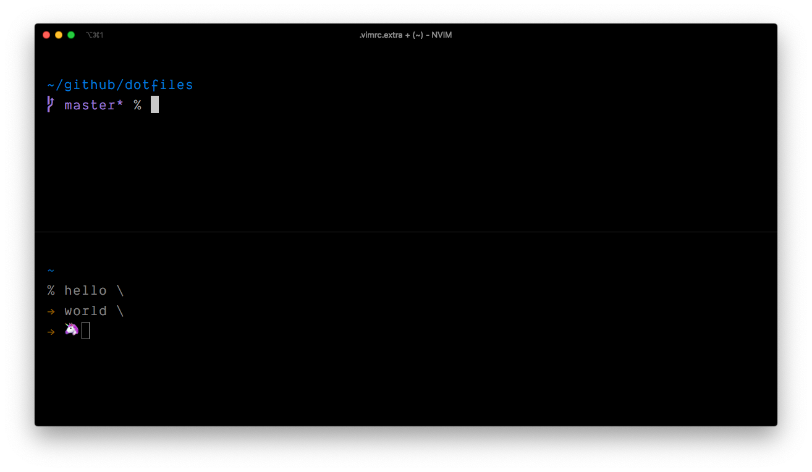

# ~/.*

Dotfiles et al

&nbsp;

	├── README.md
	├── images/         // screenshots
	├── plugins.txt     // add your vim plugins here
	├── setup.sh        // pre migration script
	└── start.sh        // dotfiles migration

&nbsp;

## Requirements

- **`ruby`**
- **`rake`**
- **`node.js / yarn`**
- **`go`** 1.12 or higher
- **`git`**
- **`vim/neovim`** install either of the two.

&nbsp;

## Get Started

> #### [NOTE] Before doing the steps below, make sure to edit the **`.extra`** file first.

&nbsp;

1. Run **`./setup.sh`** from your terminal window. This command could take a while. So get yourself a cup of coffee or a byte to eat.
	
	
2. Run **`./start.sh`** to sync the dotfiles to your home dir. Once done, then you're good to go.

	
&nbsp;

## Addendum

### What's in the box

**Vim/NeoVim Stuff**

- **[janus](https://github.com/carlhuda/janus)** - Plugin distribution awesomeness

- **[coc.nvim](https://github.com/neoclide/coc.nvim/)** - Make your vim / neovim fly!

	Btw. It's super easy to install plug-ins with COC. For instance. If you want node/js auto completion and code hinting. Just do `:CocInstall <plugin name>` inside your vim.

	LANGUAGE SERVERS INSTALLED
	
	- **gopls**
	- **flow**
	
	> will add more LS later

&nbsp;

**Bitchin' Prompt**

&nbsp;

### Custom configs and settings

I've included an easy way to add additional exports and vimrc config.

**~/.exports.after**

To add your own set of exports without touching the `.exports` file, just create a
`.exports.after` file in your home directory. The `.exports` file will actually check if this file exists and source it.

**~/.vimrc.extra**

You can create your own additional `.vimrc` settings by creating a `.vimrc.extra` file in your home dir. This will prevent you from touching the default `.vimrc` and `.vimrc.after` file.

&nbsp;

> つづく ( more later... )